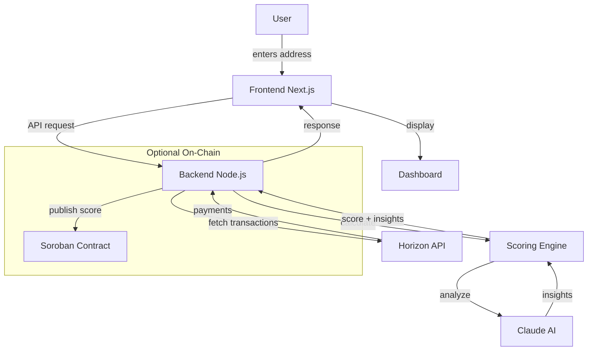

# FluxID

**Liquidity Identity Layer on Stellar — Turn any wallet into a real-time financial identity.**

[](https://stellar.org)
[](https://anthropic.com/)

---

## Overview

FluxID is a liquidity intelligence layer built on **Stellar** that turns any wallet into a real-time financial identity.

Instead of just showing balances, FluxID analyzes **how money behaves** — inflow patterns, outflow stability, transaction frequency, and flow consistency — and produces a simple, explainable trust score.

> **The Problem:** Traditional finance and crypto both track what you have, but not how you behave financially. Trust becomes guesswork.
> 
> **FluxID's Solution:** A dynamic Liquidity Identity — analyze any Stellar wallet address without permission, get a 0-100 trust score with risk level, and understand why through AI-generated insights.

---

## Architecture



### Data Flow

1. **User** enters Stellar wallet address in frontend
2. **Frontend** sends request to backend API
3. **Backend** fetches transactions via Stellar Horizon
4. **Scoring Engine** calculates liquidity score (0-100) and risk level
5. **Claude AI** analyzes patterns and generates behavior insights
6. **Frontend** displays score, risk, and AI insights
7. **Optional**: Score stored on Soroban for on-chain verification

---

## Stellar Integration

FluxID is built natively on **Stellar** for all blockchain operations.

### Horizon API — Transaction Fetching

| Function | What It Does |
|----------|-------------|
| [`getPayments()`](https://github.com/StellarVhibes/FluxID/blob/main/backend/src/services/horizon.service.ts#L36) | Fetches wallet payments via Horizon API |
| [`getAccountTransactions()`](https://github.com/StellarVhibes/FluxID/blob/main/backend/src/services/horizon.service.ts#L85) | Full transaction history |
| [Swap filtering](https://github.com/StellarVhibes/FluxID/blob/main/backend/src/services/horizon.service.ts#L62) | Excludes self-swaps from inflow/outflow |

### Freighter Wallet — Connection

| Function | What It Does |
|----------|-------------|
| [`useFreighter()`](https://github.com/StellarVhibes/FluxID/blob/main/frontend/app/context/FreighterContext.tsx#L189) | Wallet connection hook |
| [`connect()`](https://github.com/StellarVhibes/FluxID/blob/main/frontend/app/context/FreighterContext.tsx#L27) | Connect to Freighter |
| [Sign payment](https://github.com/StellarVhibes/FluxID/blob/main/frontend/lib/agentDemo.ts#L10) | Agent payment signing |

### Soroban — On-Chain Storage (Optional)

| Contract | What It Does |
|----------|-------------|
| [Score storage](https://github.com/StellarVhibes/FluxID/blob/main/backend/src/routes/contract.routes.ts#L35) | Store scores on-chain |
| [Get score](https://github.com/StellarVhibes/FluxID/blob/main/backend/src/routes/contract.routes.ts#L71) | Read from contract |

---

## AI Integration

FluxID uses **Anthropic Claude** for explainable behavior insights.

### Claude AI — Behavior Analysis

| Function | What It Does |
|----------|-------------|
| [`explainBehavior()`](https://github.com/StellarVhibes/FluxID/blob/main/backend/src/services/explainability/llm.ts#L10) | Claude Haiku integration |
| [`getExplanation()`](https://github.com/StellarVhibes/FluxID/blob/main/backend/src/services/explainability/index.ts#L8) | Entry point for AI |
| [Score + AI](https://github.com/StellarVhibes/FluxID/blob/main/backend/src/routes/score.routes.ts#L66) | Combined score + AI response |

**What Claude Analyzes:**
- Inflow/outflow consistency
- Transaction patterns over time
- Volume trends
- Risk factors
- Asset diversity

**Response:**
```json
{
  "insight": "This wallet shows consistent incoming payments...",
  "suggestions": ["Increase transaction frequency", "Diversify counterparties"]
}
```

---

## Agentic AI — X402 Payments

FluxID enables AI agents to **pay for intelligence** using Stellar.

### Payment Flow

| Step | What Happens |
|------|------------|
| 1. Request | Agent requests `/paid/score/{wallet}` |
| 2. 402 Response | [`HTTP 402 Payment Required`](https://github.com/StellarVhibes/FluxID/blob/main/backend/src/routes/paid.routes.ts#L184) |
| 3. Payment | Agent pays XLM via Freighter |
| 4. Verify | [On-chain verification](https://github.com/StellarVhibes/FluxID/blob/main/backend/src/services/payment.service.ts#L92) |
| 5. Score | Return score after payment |

### Agent Demo

Live demo showing AI agent:
- [Requesting score](https://github.com/StellarVhibes/FluxID/blob/main/frontend/lib/agentDemo.ts#L69)
- [Signing payment](https://github.com/StellarVhibes/FluxID/blob/main/frontend/lib/agentDemo.ts#L58)
- [Polling for result](https://github.com/StellarVhibes/FluxID/blob/main/frontend/lib/agentDemo.ts#L145)

---

## Core Features

| Feature | Description |
|---------|------------|
| Address-based analysis | Analyze any wallet without permission |
| Liquidity Score | 0-100 trust score |
| Risk Level | Low / Medium / High |
| Flow breakdown | Inflows, outflows, swaps tracked separately |
| Behavior insights | AI-generated explanation |
| Suggestions | Actionable recommendations |

---

## What FluxID Really Is

FluxID is not just an app or a dashboard.

It is a decision layer.

It answers one simple question:

"Can this wallet be trusted financially?"

Instead of guessing, platforms can:

- Query a wallet's behavior
- Get a trust score
- Understand why that score exists
- Make decisions instantly

---

## Core Product Principle

FluxID can analyze any wallet address without requiring ownership.

This means:

- No login required
- No wallet connection required
- No permission needed

Wallet connection exists only for:

- Convenience (auto-fill)
- Future identity features

Not for access.

---

## Problem

Both traditional finance and crypto miss something critical:

They track what you have, but not how you behave financially.

Because of this:

- Freelancers struggle to prove reliability
- Payments get delayed due to lack of trust
- Cross-border transactions carry uncertainty
- Credit systems are slow, fragmented, or unavailable

In Web3:

- Wallets are anonymous
- Reputation is fragmented
- No standard trust layer exists

So trust becomes guesswork.

---

## Solution

FluxID introduces a Liquidity Identity — a dynamic score based on financial behavior.

It analyzes:

- Income consistency
- Spending patterns
- Transaction frequency
- Flow stability

And produces:

- Liquidity Score (0-100)
- Risk Level (Low / Medium / High)
- Score Breakdown (inflow, outflow, frequency)
- Key Risk Factors
- Human-readable insights
- Actionable suggestions

---

## Explainability (Core Differentiator)

FluxID does not just output a score.

It explains it.

For every wallet, users can see:

- Why the score was given
- What patterns were detected
- A breakdown of contributing factors
- Transaction flow over time

This ensures:

- Transparency
- Trust
- Immediate understanding

---

## Why On-Chain Storage Matters

While scoring is computed off-chain for speed and flexibility, storing results on-chain provides:

- Verifiability → Scores can be independently checked
- Portability → Any app can read the same trust signal
- Transparency → No hidden or mutable backend logic

This makes the smart contract the **source of truth**, while the backend remains the **computation engine**.

---

## Real Use Cases

FluxID is infrastructure — not just a product.

### Lending Platforms

- Score = 82 → Approve loan
- Score = 34 → Reduce or reject

### Freelance Platforms

- Consistent inflow + stable spending → Reliable user

### Remittance Apps

- Detect behavior patterns → Suggest better allocation

### Marketplaces

- Trusted users → Enable flexible payments

---

## AI Layer (Explainability)

FluxID uses a hybrid model:

- Rule-based engine → scoring logic (deterministic)
- AI models → explanations, reasoning, suggestions

This ensures:

- Consistent scoring
- Clear explanations
- Better usability

---

## Tech Stack

| Layer | Technology |
|-------|-----------|
| Blockchain | Stellar (Horizon + Soroban) |
| Backend | Node.js + Fastify |
| Frontend | Next.js + TypeScript |
| AI | Anthropic Claude (Haiku) |
| Wallet | Freighter |
| Styling | Tailwind CSS |

---

## Project Structure

```
FluxID/
├── frontend/           # Next.js PWA
│   ├── app/
│   │   ├── dashboard/   # Main analysis
│   │   ├── analytics/  # Flow charts
│   │   ├── transactions/ # History
│   │   ├── insights/   # AI explanations
│   │   └── agent/     # Agent demo
│   ├── components/     # UI components
│   └── lib/          # Scoring + agent
├── backend/           # Node.js scoring
│   ├── src/
│   │   ├── routes/     # API endpoints
│   │   ├── services/   # Horizon + AI
│   │   └── utils/     # Scoring
├── smartcontract/     # Soroban contracts
└── docs/            # Documentation
```

---

## Getting Started

```bash
# Frontend
cd frontend && npm install && npm run dev

# Backend  
cd backend && npm install && npm run dev
```

---

## Key Links

- [Frontend](https://github.com/StellarVhibes/FluxID/tree/main/frontend)
- [Backend](https://github.com/StellarVhibes/FluxID/tree/main/backend)
- [Smart Contracts](https://github.com/StellarVhibes/FluxID/tree/main/smartcontract)

---

## Post-MVP Roadmap

### Overview

After MVP, FluxID evolves from:

- **Scoring one wallet**

to:

- **Understanding entire user bases**

> **Protocol Intelligence Layer**

FluxID becomes a system for analyzing groups of wallets using trust scores.

---

### 1. User-Base Health Dashboard

Platforms can monitor overall user quality.

- Average score
- Distribution (Low / Medium / High)
- Score trends over time
- Risk concentration

---

### 2. Cohort & Segmentation Engine

Query wallets based on behavior.

**Examples:**

- Score > threshold
- Monthly inflow > threshold
- Interaction with contracts

**Used for:**

- Lead generation
- Risk filtering
- User targeting

---

### 3. Risk Heatmaps

Understand where risk is concentrated.

- High-risk clusters
- Risky counterparties
- Transaction relationships

---

### 4. Early Warning System

Detect sudden changes in risk.

- Score drops
- Risk spikes
- Behavioral anomalies

**Example:**

> "12% of users dropped below score 50 in 24 hours"

---

### 5. AI Agent Layer

Enable autonomous systems to:

- Query scores
- Make decisions
- Pay per request (X402)

---

## Vision

FluxID is building a new primitive:

> **Liquidity Identity**

A real-time, behavior-based trust layer for financial systems.

---

## Maintainers

Project maintained by @bbkenny and @xqcxx
